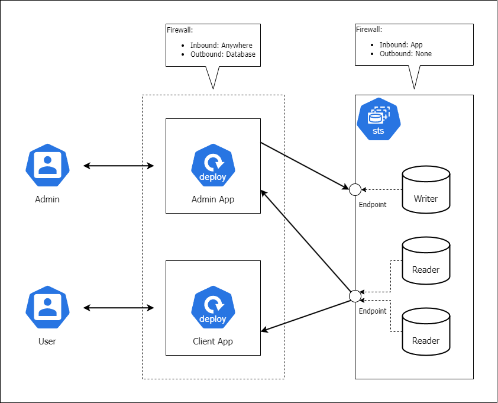

# LAB 2

Images:

- [Admin app](./image.client-web/)
- [Client app](./image.client-result/)
- Database: mysql:5.7
  - ENV: MYSQL_DATABASE, MYSQL_TCP_PORT, MYSQL_ROOT_PASSWORD, MYSQL_USER, MYSQL_PASSWORD

---

## Day 1: Pod Management and Services

- **Goal**: Manage Pods and set up communication between Admin App, Client App, and Database.
- **Practices**:
  1. Create **Pods for Admin App and Client App** using YAML manifests.
  2. Create **StatefulSet** for the **Database** with a Writer and two Readers, simulating the setup.
  3. Set up **ClusterIP Services** to expose the Admin and Client Apps internally, and the **StatefulSet** as an internal database.
  4. Use **labels and selectors** to differentiate Admin App, Client App, and Database Pods.
  5. **Test communication** between Admin App, Client App, and the Database via the internal services.

---

## Day 2: Ingress, Egress, and Networking

- **Goal**: Configure Ingress and secure traffic flow between the apps and the database.
- **Practices**:
  1. Install an **Ingress Controller** to expose the Admin App and Client App to external users.
  2. Create **Ingress Resources** for both Admin App and Client App, routing traffic based on roles (Admin vs User).
  3. Configure **Network Policies** that restrict access to the Database only from Admin and Client Apps, as per firewall rules.
  4. Test **Egress policies** ensuring Admin and Client Apps can only access the Database, and there’s no outbound traffic allowed elsewhere.
  5. Verify that **traffic flows** only through the defined paths (e.g., Admin to Admin App, User to Client App, both Apps to Database).

---

## Day 3: Labels, Selectors, and Namespaces Management

- **Goal**: Organize the system with labels, selectors, and namespaces to manage the two applications and the database.
- **Practices**:
  1. Use **labels and selectors** to define Admin and Client Apps clearly.
  2. Create **different namespaces** for Admin App, Client App, and Database to ensure clear separation of components.
  3. Apply **Network Policies** between namespaces to restrict communication according to the firewall rules (Admin App can only access the Database, etc.).
  4. Deploy each component in its respective namespace and test **cross-namespace communication**.
  5. **Verify policies** to ensure Admin and Client Apps do not interfere with each other.

---

## Day 4: Deployments, Scaling, and Health Checks

- **Goal**: Deploy and scale both applications while ensuring they remain healthy.
- **Practices**:
  1. Create **Deployments** for the Admin App and Client App, each with multiple replicas.
  2. **Scale** the Admin and Client Apps as needed, and test how they handle increased load.
  3. Set up and test **Readiness, Liveness, and Startup probes** for both applications to ensure they are always responsive.
  4. Perform **rolling updates and rollbacks** on both Deployments, ensuring zero downtime.
  5. Optimize **resource requests** for both Admin and Client Apps to make efficient use of CPU and memory.

---

## Day 5: Stateful Applications and DaemonSets

- **Goal**: Deploy the stateful database service using StatefulSets and manage nodes using DaemonSets.
- **Practices**:
  1. Create a **StatefulSet** for the Database (with one Writer and two Readers).
  2. Set up **Persistent Volumes and Persistent Volume Claims (PVCs)** for storing the data of the StatefulSet.
  3. Deploy a **DaemonSet** for logging or monitoring purposes that runs on all nodes in the cluster.
  4. Ensure the **StatefulSet Writer-Reader** behavior is working as expected with separate endpoints.
  5. Compare the behavior of **StatefulSets and Deployments** in terms of pod identity and persistence.

---

## Day 6: Persistent Storage and Configuration Management

- **Goal**: Manage persistent storage for both applications and the database, along with secure configurations.
- **Practices**:
  1. Create **Persistent Volumes** and **PVCs** for Admin and Client Apps if needed (e.g., logs or session data).
  2. Ensure **PVCs are correctly mounted** in the StatefulSet for the Database Pods (Writer and Readers).
  3. Use **ConfigMaps** to manage non-sensitive configuration data (e.g., database URLs for Admin and Client Apps).
  4. Use **Secrets** to store and manage sensitive information (e.g., database credentials) and inject them into the appropriate Pods.
  5. Test both **ConfigMaps and Secrets** by injecting them as environment variables or volumes into Admin and Client Apps.

---

## Day 7: Security, Resource Optimization, and Monitoring

- **Goal**: Secure the system with RBAC, optimize resources, and monitor system health.
- **Practices**:
  1. Set up **RBAC** to manage access control for Admin and Client Apps, limiting access based on roles (Admin vs. User).
  2. Create **Roles, RoleBindings, and ServiceAccounts** to define specific permissions for Admin and Client components.
  3. Set **resource requests and limits** for the Admin and Client Apps to ensure efficient use of cluster resources.
  4. Install **Prometheus and Grafana** for monitoring the health and performance of all applications and the database.
  5. Set up **centralized logging** using Fluentd or the ELK stack to track activity in Admin and Client Apps, as well as the Database.

---
